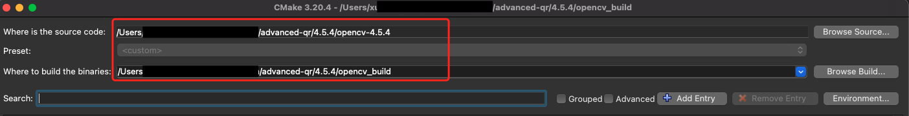
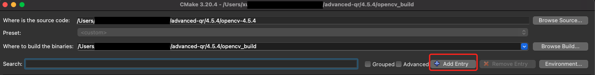
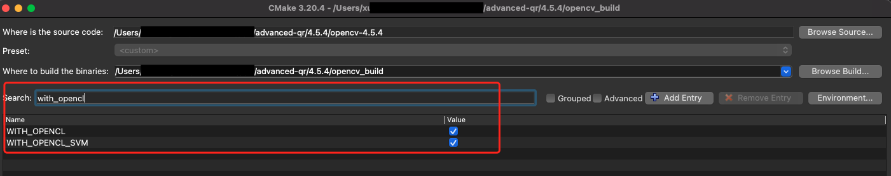
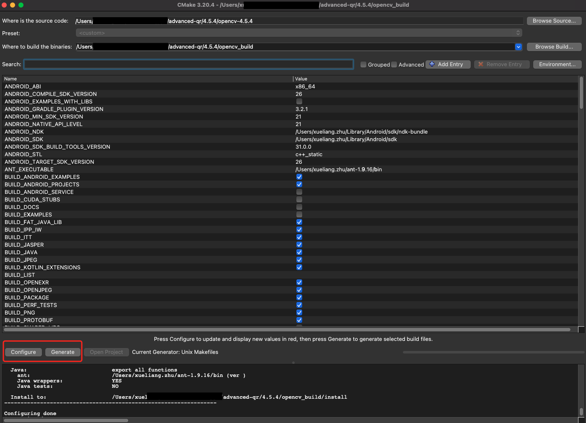

## OpenCV QrCode Parser
For now, we build it by OpenCV 4.5.4

### How to use

1. add dependency
```
implementation 'com.iossocket:opencv-qrcode-parser:4.5.4'
```

2. init OpenCV in Application
```
OpenCV.initAsync(this);
WeChatQRCodeDetector.init(this);
```

3. parse image from `Bitmap`
```
List<String> result = WeChatQRCodeDetector.detectAndDecode(bitmap);
```

### How to build new version
> We can not use the official OpenCV SDK directly, because we need the qr engine in opencv_contrib

##### 1. prepare the env
MacOS, cmake 3.20.4, java 1.8, apache-ant-1.10.7, android sdk, ndk-bundle

##### 2. prepare OpenCV source code
* OpenCV 4.5.4, 
* opencv_contrib 4.5.4

##### 3. open camke
input the source code directory and the build destination directory



##### 4. Add entry



* ANDROID_NDK, type is path, input your ndk path
* ANDROID_SDK, type is path, input your android sdk path
* ANDROID_ABI, type is string, options include armeabi-v7a, arm64-v8a, x86, x86_64, can start from armeabi-v7a
* ANDROID_NATIVE_API_LEVEL, type is string, default value is 21
* ANT_EXECUTABLE, type is path, input your ant path
* ANDROID_STL, type is string, input c++_static

##### 5. Config toolchain

* Configure -> Specify toolchain file for cross-compiling -> Continue -> input your NDK toolchain path(for me it is ~/Library/Android/sdk/ndk-bundle/build/cmake/android.toolchain.cmake) -> Done

##### 6. Add opencv_contrib path in entry
* OPENCV_EXTRA_MODULES_PATH, type is path, input your opencv_contrib/modules

##### 7. Config WITH_OPENCL & WITH_OPENCL_SVM
* search `with_opencl`, and check the checkbox



##### 8. Final config
click `Configure`, and then click `Generate`



##### 9. Build
cd into the build directory you config in the STEP 3, run `make`. it may take more than 1 hour
> You may find some error when it comes to 99%, but the so file is generated already in `opencv_build/jni/...`

##### 10. Build armeabi-v7a, arm64-v8a, x86, x86_64, one by one.
> When building x86_64, need to disable `with_ipp` in entry

##### 11. Update source code in `src/org/...` if needed

##### 12. Update qr model in `src/main/...` if needed

##### 13. Update `build.gradle` if needed

##### 14. Update publish.gradle for release `./gradlew assemble publish -b publish.gradle`

